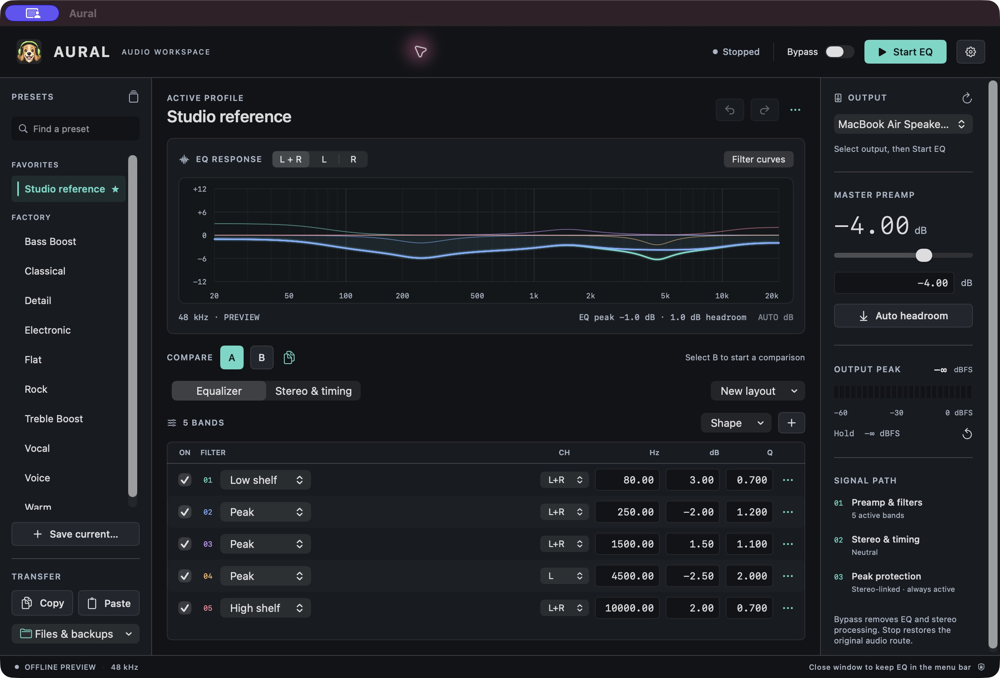
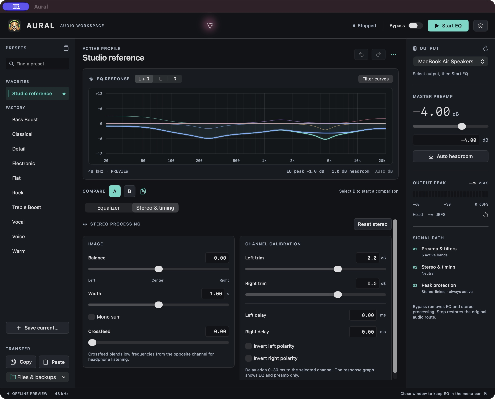

<p align="center">
  
</p>
<h1 align="center">Aural</h1>
<p align="center">A native macOS equalizer. Shape your sound, keep your settings local.</p>

Aural adjusts the sound playing through your chosen stereo output. Use the main window to fine-tune your EQ, or control it from the menu bar. No extra audio driver is required.

## Download and install

**[Download the latest release](https://github.com/NikoZBK/aural/releases/latest)** — universal DMG for **Apple silicon and Intel**, requiring **macOS 14.2 or newer**. A ZIP is also available.

1. Open the DMG and drag **Aural** to **Applications**.
2. Eject the DMG and launch the installed app.
3. Choose your output, click **Start EQ**, and allow system audio capture when prompted.

**Signing:** this release is ad-hoc signed, not Developer ID signed or notarized. macOS may require **System Settings → Privacy & Security → Open Anyway** after the first blocked launch. Follow [Apple's instructions](https://support.apple.com/102445) if you trust the download. Managed Macs may prohibit this. Developer ID signing and notarization are needed for a release that avoids this approval step.

## Updates

Choose **Check for Updates…** from the Aural menu, menu bar controls, Settings, or About. Aural shows the latest stable version and release notes. **Download Update** opens the installer download in your browser. Quit Aural, open the download, and replace the installed app; your saved settings stay on your Mac. The **Releases page** link is always available if the check fails. Updates are not automatically installed.

## Screenshots

The expandable workspace keeps your current preset, EQ curve, selected filter, and output controls in view.



Stereo and delay controls let you adjust the left and right channels and how they blend together.



Screenshots use factory and demo presets.

These screenshots show Aural 1.0. Aural 1.2 uses the expandable workspace described below.

## Features

- One **expandable workspace** for listening and editing: select a numbered filter on the curve, or use **Show details** to open exact values, all rows, faders, and stereo controls.
- Saved **System, Light, and Dark** themes across windows, graphs, and native dialogs, using your macOS accent color.
- Optional **Liquid Glass** controls and window chrome using Apple's native material on macOS 26 or later.
- Presets, the EQ curve, editable filters, and output controls together in one window.
- Ten-band and 31-band EQ, sliders and exact numbers, and up to 32 adjustable filters.
- Filters for the **left, right, or both channels**, including peak, shelf, pass, notch, and all-pass types.
- A/B comparison: edit two versions, switch between them, and compare their curves. Undo or redo up to 100 changes.
- Stereo controls for left/right level, balance, width, crossfeed, mono, polarity, and 0–30 ms delay.
- Separate left/right EQ curves (solid accent and dotted blue), individual filter curves, and values shown as you move over the curve.
- Preamp, **Auto preamp** to help prevent clipping, and an output level meter that remembers the highest level.
- Adjust all band gains at once, reduce or invert their effect, or shift their frequencies.
- Copy, paste, import, and export AutoEQ / Equalizer APO text, including left/right filter settings.
- Search the online AutoEQ headphone catalog, compare measurement sources, and preview corrections before importing.
- A searchable preset library with favorites, curve previews, duplicate/rename/delete, undo delete, and JSON backups.
- Saved settings for each output, menu bar controls, keyboard shortcuts, and optional automatic startup.

The [feature comparison](docs/PEACE-FEATURE-ROADMAP.md) lists what Aural supports and what is still missing compared with Peace and Equalizer APO.

## Using Aural

The main window has one workspace. Use **Show details / Hide details** to expand or collapse editing controls without changing your sound. Select a numbered point on the EQ curve to open that filter’s exact values. Click and drag a point horizontally to change frequency and vertically to change gain; each drag is one undo step. Fixed graphic bands move vertically only, while gainless filters move horizontally only. Q, filter type, channel, and disabled state are preserved. The **Selected filter** picker also reaches overlapping points, disabled filters, and frequencies outside the graph. **Selected**, **All rows**, and **Faders** offer focused numeric editing, a complete filter table, or gain sliders. **Stereo & delay** exposes the complete stereo controls.

The previous saved Simple/Professional preference determines whether details initially open collapsed or expanded. New installations start collapsed. All menu commands, clipboard shortcuts, A/B comparison, preamp, and output controls remain available in either state. Showing details never replaces or flattens the active EQ. Graphic EQ gain edits retain their existing representation; **Edit filter parameters…** or **All rows** explicitly converts graphic bands to equivalent editable filters.

Choose a preset from the dropdown at the top of the full-width workspace. Favorites, personal presets, and factory presets are grouped in the dropdown, with **Manage presets…** below them. Save sits beside the current preset, and **Files** in the top toolbar contains import, export, clipboard, and backup actions. Output selection is in the top toolbar; preamp, Auto preamp, output level, and processing status are in the bottom strip. Hover over the peak reset button to inspect the held peak. The EQ curve reports estimated headroom separately from the measured output level.

Faders show the active EQ’s actual frequencies and gains: drag up to boost and down to cut, double-click for 0 dB, or use the arrow keys on a focused bar. Imported filters keep their frequency, Q, type, channel, and enabled state; gainless filters have no gain control. **Reset EQ** sets band gains and preamp to 0 dB while preserving filter settings and stereo adjustments; one Undo restores the previous EQ. Meter readings update independently, while curve and Auto preamp calculations run in the background. Auto preamp shows progress and rejects results if the EQ or output changed during calculation.

Choose **Theme** in the gear settings, **View** menu, or headphones menu. **System** follows your Mac's light/dark appearance; **Light** and **Dark** keep a fixed appearance. Every theme uses your macOS accent color for highlights, buttons, and the main EQ curve. The choice is saved and applies immediately to all Aural windows, popovers, graphs, and file dialogs. Changing themes keeps the current EQ, playback, and drafts. Dark remains the default for both new and existing installations.

Choose **Style → Liquid Glass** in the same settings or menus to use Apple's native glass material for window chrome and controls on macOS 26 or later. Style and Theme are independent: glass works with System, Light, or Dark. **Standard** remains the default. The graph, filter tables, and exact-number fields keep their readable surfaces. Reduce Transparency or Increase Contrast restores solid surfaces; Reduce Motion disables the custom glass interaction effect. A saved glass preference uses Standard surfaces on older macOS versions. See the [implementation notes and Apple SDK references](docs/LIQUID-GLASS.md).

Select the output that your apps use. Aural does not change the macOS default output or affect sound playing through another device. **Stop** returns audio to its normal path. **Bypass** turns off EQ, preamp, and stereo effects while keeping Aural's audio connection and peak protection active. Close the last Aural window with the red close button or **Command-W** to remove Aural from the Dock while keeping EQ and the menu bar controls running. Choose **Show Aural** from the headphones menu to bring the window and Dock icon back. Minimized windows keep their Dock access. **Quit Aural** or **Command-Q** stops EQ and exits completely.

The closed-eyes dog appears while EQ is processing. The original open-eyed dog listens when EQ is stopped or bypassed. The main window, About window, and running app's Dock icon update together, including after using controls in the menu bar. Finder keeps the original happy icon.

The main window and preset menu show the selected preset. An **EDITED** badge in the main window marks changes from the saved version. The selection is remembered separately for each output. Saving under a new name selects that preset; renaming updates its displayed name, and deleting it leaves the current sound as Custom EQ.

Selecting a preset applies it immediately, starts EQ if stopped, and turns bypass off. Switching between saved AutoEQ profiles and built-in presets keeps audio running. If a preset cannot run at the output's current sample rate, Aural explains the problem and keeps the current sound unchanged.

The gear menu controls startup. With automatic EQ enabled, Aural restores the saved output and EQ settings and waits up to 60 seconds for that exact device. It does not apply headphone settings to another device when the original is disconnected. Aural displays startup and permission errors. Sleep stops EQ; start it again after wake.

### AutoEQ search and import

The graph includes a dashed purple **Harman** acoustic reference, normalized to 0 dB at 1 kHz. Use its **Harman** menu to hide it or choose **over-ear 2018** or **in-ear 2019**. Automatic selection uses in-ear 2019 for online profiles identified as in-ear and over-ear 2018 otherwise. The solid lines show EQ gain; the dashed Harman line is an acoustic target, so their difference is not a measurement of headphone accuracy. It does not change audio, Auto preamp, or the reported EQ headroom. Both published curves and their [source license](Sources/Aural/Resources/Targets/AutoEQ-LICENSE.txt) are bundled for offline use. The same reference controls appear in the main graph, AutoEQ search, preset library, and draft editor.

Click **AutoEQ** in the main toolbar, choose **Files → Search AutoEQ profiles…** or **Equalizer → Search AutoEQ profiles…**, or use **AutoEQ…** in the preset library. Search by headphone brand/model and filter by measurement source. Model numbers match with or without spaces and hyphens. Each measurement stays separate; its source, rig/collection, and original result link appear alongside a preview of the downloaded parametric correction. These are AutoEQ’s computed settings, not necessarily the measurement author’s manually tuned EQ.

**Import profile** validates the complete download, replaces the current EQ, stops processing, and saves a named preset with its source attribution. Click **Start EQ** when ready. Repeated imports receive numeric suffixes; **Undo** restores the previous EQ. Searching, previewing, cancelling, or a failed download leaves the current sound unchanged. The loaded catalog stays available in the browser window; **Refresh AutoEQ catalog** fetches the latest index. The first load and uncached profile downloads require an internet connection. Headphone data is fetched from the public [AutoEQ results catalog](https://github.com/jaakkopasanen/AutoEq/tree/master/results), under the project’s [MIT license](https://github.com/jaakkopasanen/AutoEq/blob/master/LICENSE); correction data is not bundled with Aural.

Choose **Files → Import AutoEQ text…** (or the Equalizer menu) and select a UTF-8 parametric or fixed-band text export. The complete file is validated before current settings change. Import stops processing, replaces the previous EQ, and saves a named preset. Click **Start EQ** when ready. Repeated filenames receive a numeric suffix instead of overwriting existing presets.

Edit filters directly in the main window: choose their type, frequency, gain, Q (which controls filter width), and whether they are enabled. Set the exact overall gain with **Preamp**. Add or remove filters up to the 32-filter limit. **EQ options → Edit as a draft…** opens a separate editor where you can preview changes before applying them. **Apply EQ** checks the complete draft and updates EQ; if EQ was stopped, it stays stopped. **Cancel** leaves the current sound unchanged. Invalid values keep the editor open with an explanation. Save a named preset to reuse the changes. Imported values retain their precision until edited. To replace the current EQ deliberately, choose **EQ actions → New EQ → New flat 10-band EQ** or **New flat 31-band EQ**. You can undo a layout change, and it preserves stereo settings. Imports replace the previous EQ rather than adding to it.

Supported commands are a global `Preamp`, `Channel: ALL`, `Channel: L`, `Channel: R`, and numbered `Filter` lines using `PK`, `LSC`, or `HSC` with `Fc`, `Gain`, and `Q`; or `LPQ`, `HPQ`, `BP`, `NO`, and `AP` with `Fc` and explicit `Q` (no Gain field). Pass/notch filter gain is not adjustable; band-pass has unity peak gain. LPQ/HPQ are second-order filters with adjustable Q. Shorthand LP/HP, omitted Q, bandwidth syntax, and higher-order filters are not yet supported. Blank lines, `#` comments, OFF filters, CRLF, and a UTF-8 BOM are accepted. No Preamp line means 0 dB. Limits are 32 filters, 10–22000 Hz, −30 to +30 dB filter gain, Q 0.05–50, −60 to +24 dB imported preamp, and 64 KB file size. All filters may be disabled; their values remain saved and preamp, stereo effects, and peak protection still affect audio. Global Bypass additionally bypasses preamp and stereo effects. A per-channel `Preamp` command is rejected; use Aural’s channel trims for this.

`GraphicEQ:` curves, WAV convolution, CSV measurements, and other APO commands are not supported. Use AutoEQ's **ParametricEQ.txt** or **FixedBandEQ.txt** export for file import. Online search downloads **ParametricEQ.txt** profiles.

## Privacy

Aural does not record audio files, collect telemetry, or upload profiles. Opening **Check for Updates…** sends a request to GitHub for the latest public release (including Aural’s version in the User-Agent); there are no background update checks. Opening AutoEQ search requests the public catalog from GitHub, and selecting a result downloads that profile. Search terms and source filters stay on your Mac. Downloads use normal HTTP caching; Refresh requests a fresh catalog. GitHub receives normal connection information such as your IP address and the requested profile path. Source links open in your default browser. Audio is processed locally in memory. Only system audio input is used; hardware input streams are disabled when present.

Settings and imported profiles are stored in the current user's `~/Library/Application Support/Aural/settings.json`. They are created at runtime and are **not** included in the app, installer, repository, or releases. Tests use invented data rather than downloaded headphone profiles. A new installation starts with flat EQ and both startup options off.

## Current scope

Aural currently targets stereo listening and calibration. It supports a single stereo output stream in 32-bit float format at 32–192 kHz. It does not support mono/surround outputs, multi-stream interfaces, aggregate/multi-output setups, per-app mixing, or convolution. Bluetooth, USB hardware, sleep/wake behavior, protected media, and extended operation need further hardware testing. Intel is cross-compiled; runtime checks to date were performed on Apple silicon.

Latency depends on the device buffer size and has not been measured. Peak protection is a sample-peak limiter, not a true-peak mastering limiter. A built-in band at or above 49% of sample rate is disabled. For imported profiles, an enabled filter beyond that threshold prevents starting rather than silently changing the profile; select a higher sample rate in Audio MIDI Setup. The stopped response preview uses 48 kHz; processing uses the actual device rate.

If there is no output signal, check the selected output and **System Settings → Privacy & Security → Screen & System Audio Recording**. Quit and reopen after granting access. See [installation, updates, and removal](docs/INSTALL.txt).

## Build and test

Install Apple's Command Line Tools or Xcode with the macOS 26 SDK or newer, then run:

```sh
bash scripts/test.sh
bash scripts/build.sh
bash scripts/package.sh
```

- `test.sh`: DSP tests with AddressSanitizer/UndefinedBehaviorSanitizer and Swift parser/startup tests.
- `build.sh`: compiles arm64 and x86_64, combines them into a universal executable, adds the icon, signs locally, and creates a ZIP in `dist/`.
- `package.sh`: builds the app, creates a drag-to-Applications DMG, verifies the image, and writes SHA-256 checksums.
- `make-icon.sh`: regenerates the complete macOS ICNS size set from the included PNG.

No third-party runtime dependencies or package downloads are required. Build outputs are ignored by Git. [Release and signing instructions](docs/RELEASING.md) describe optional Developer ID signing and notarization.

The [future updates guide](docs/FUTURE-UPDATES.md) covers proposed priorities, code locations, compatibility rules, testing, and release handoffs.

## Implementation

`Audio.swift` owns the private process tap and aggregate device. Aural excludes its own process to prevent feedback and mutes the original stream only while the tap is consumed. It uses the selected output's clock. The callback is stopped and destroyed before its DSP state is freed.

`DSP.c` implements RBJ biquads, preamp, peak protection, and a bounded lock-free settings queue. Coefficients and gain conversion are prepared on the control thread. Live changes crossfade between two preallocated filter chains over 20 ms; rapid edits are coalesced to the latest pending state after the current fade completes. Unchanged filter prefixes retain their state. Bypassed chains continue processing internally to avoid stale-state replay. Steady-state output is unchanged for existing peaking and shelf profiles. The audio callback performs no allocation, locks, logging, filesystem access, or Swift/Objective-C calls. Stereo processing applies normalized 700 Hz crossfeed, mid/side width or mono sum, per-channel trim/balance/polarity, fractional delay, then sample-peak protection.

Tests cover measured frequency response, channel isolation, preamp/bypass, sample rates, clipping protection, buffer layouts, invalid controls, peaking/shelf response, AutoEQ validation and precision, saved-settings migration, and startup device selection. Native launch, import, saved-profile reload, and automatic startup have also been checked on Apple silicon.

[Apple Core Audio taps](https://developer.apple.com/documentation/coreaudio/capturing-system-audio-with-core-audio-taps) · [AutoEQ](https://github.com/jaakkopasanen/AutoEq) · [Icon provenance](docs/ICON.md)

## About

Created by **Nikolay Ostroukhov**. The app includes an About window with version information, credits, license, and project links.

## License

MIT. See [LICENSE](LICENSE). Aural is an independent project and is not affiliated with Apple or AutoEQ.

### Copy and paste EQ settings

Click **Copy settings (Equalizer APO format)** on a headphone EQ page, then **Paste EQ** in Aural (⇧⌘V). Aural validates the complete text, saves it as a “Clipboard EQ” preset, and stops processing. Click **Start EQ** when ready. Invalid or empty clipboard text reports an error without changing your EQ or stopping audio.

**Copy EQ** (⇧⌘C) copies the current preamp and every filter in Equalizer APO / AutoEQ text format, preserving precision and disabled filters. The ten-band equalizer exports as ten peaking filters with the same frequencies and Q. Both actions are also in the **Equalizer** menu; ordinary text-field copy and paste shortcuts remain available.

### Preset library and editing tools

Choose **Manage presets…** in the preset dropdown, or choose **Equalizer → Preset library…** (⇧⌘P) to search, favorite, duplicate, rename, or delete presets. Built-in presets can be duplicated and favorited; renaming and deletion apply to custom presets. **Undo delete** restores the most recent deletion until Aural quits. Deleting or renaming a saved preset does not change the active EQ.

**Back up presets…** writes a versioned JSON file containing custom presets and favorites. **Restore presets…** validates the entire backup before merging; conflicting names receive numeric suffixes. Restore never replaces the current EQ or enables processing. Device selection, startup preferences, and per-device settings are not part of a preset backup.

The menu bar now includes preset selection, favorites, and preamp adjustments in 1 dB steps within the current EQ limits. These controls preserve the current bypass and playback state when changing preamp. **Export EQ…** saves the current Equalizer APO settings to a text file.

In **EQ options → Edit as a draft…**, each row's actions menu can duplicate or move a filter up/down. **Undo** and **Redo** restore up to 100 draft edits, including filter additions/removals, order, values, enabled state, and preamp. These changes remain a draft until **Apply EQ**; **Cancel** leaves playback unchanged.

### Compare settings and adjust stereo

Select **B** to make a second copy of your current EQ settings. Edit A or B, then switch between them to compare. Each keeps its own EQ, stereo settings, and preset name. A dashed curve shows the other version when it differs. Use the comparison menu to copy one version to the other or reset both. A/B settings and undo history reset when you change output or quit Aural; save each version as a preset to keep it.

**Undo/Redo** covers EQ and stereo edits, band layout changes, applying presets, and A/B switching. Each slider drag counts as one change. Keyboard shortcuts are **⌥⌘Z / ⇧⌥⌘Z** for EQ undo/redo, **⌥⌘1 / ⌥⌘2** for A/B, and **⌥⌘B** for bypass. These shortcuts work while Aural is active; ordinary text-field undo/copy/paste remain available. Undo does not change whether EQ is running or bypassed.

**Stereo & delay** lets you adjust left/right levels, balance, stereo width, crossfeed, mono, polarity, and delay. Crossfeed blends low frequencies from the opposite channel for headphone listening. Width 1 keeps the original stereo sound; width 0 combines both channels into mono. Mono is applied before the separate left/right adjustments. Defaults leave the sound unchanged. Delay adds the amount you enter; it does not measure the total delay through your Mac. The EQ curve shows filters and preamp only, without stereo effects or peak protection. **Auto preamp** sets a level based on estimated EQ and stereo gain to help prevent clipping; it is not a true-peak guarantee.

APO text supports channel-targeted filters, but does not encode Aural's stereo effects. Copy/export rejects nonneutral stereo effects with an explanation, so they cannot be silently discarded. Save a preset and use **Files → Back up presets…** to preserve the complete configuration, including stereo settings. Legacy presets remain compatible; new stereo/channel presets require Aural 1.0.0 or later.

### Engine verification

The engine tests measure response at 32, 44.1, 48, 96, and 192 kHz, check all-pass phase inversion at its center frequency, exercise explicit disabled filters, and stress rapid updates and 32-filter extremes. A magnitude floor of −300 dB per filter keeps exact notch zeros finite in the response calculation; it does not change audio. Nonfinite samples and malformed buffers latch faults for the control thread instead of sending invalid samples to the output.

Filter equations follow the [W3C Audio EQ Cookbook](https://www.w3.org/TR/audio-eq-cookbook/); text syntax follows the supported subset of the [Equalizer APO reference](https://sourceforge.net/p/equalizerapo/wiki/Configuration%20reference/). Profiles containing new filter types require Aural 0.8.0 or later.

The [0.9.0 interface notes](docs/RELEASE-0.9.0.md) describe the earlier Ultra interface. [0.9.2 release notes](docs/RELEASE-0.9.2.md) cover selected-preset display and the dog-with-headphones icon. [0.9.3 release notes](docs/RELEASE-0.9.3.md) cover running in the menu bar after closing the window. [0.9.4 release notes](docs/RELEASE-0.9.4.md) cover sleeping and happy icon states.

[1.0.0 release notes](docs/RELEASE-1.0.0.md) cover the redesigned equalizer, left/right EQ, stereo controls, A/B comparison, and reversed dog states.

[1.1 release notes](docs/RELEASE-1.1.0.md) cover system-accent themes, faster mode switching, visual EQ bars, Reset EQ, and resizable panes.
