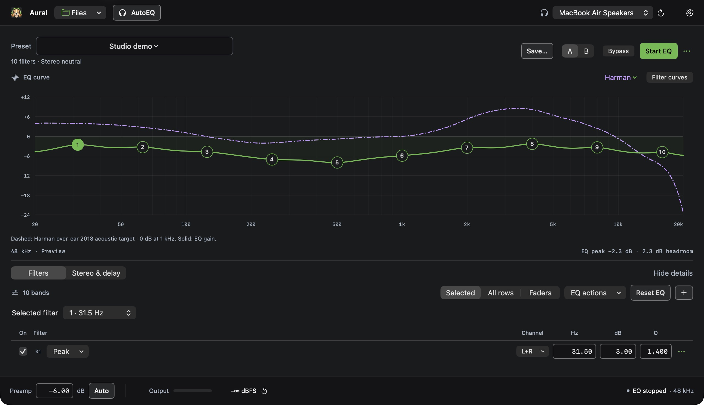
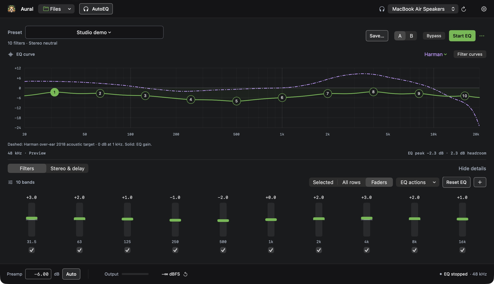
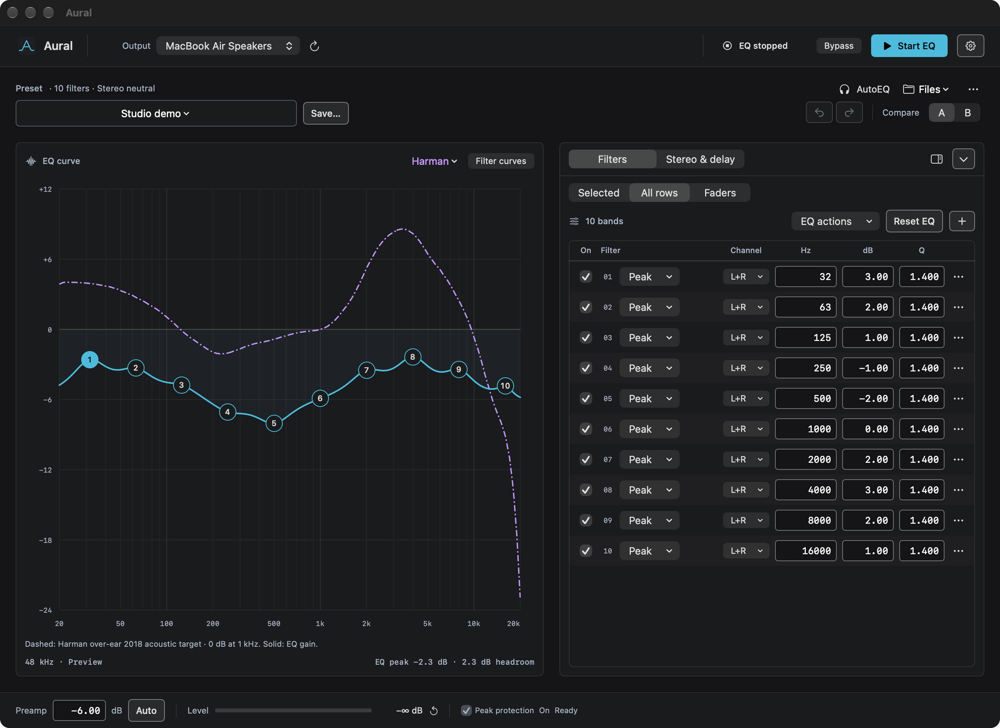
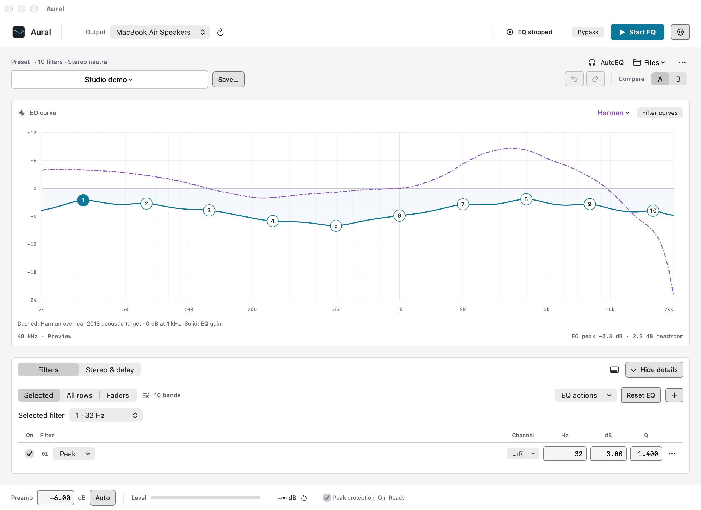

  

<h1 align="center">Aural</h1>

A native macOS equalizer. Shape your sound, keep your settings local.

  <a href="https://github.com/NikoZBK/aural/releases/latest"><b>Download</b></a> · macOS 14.2 or later · Apple silicon and Intel

**Faders.** Adjust gain at each filter's own frequency.

**Side panel.** See every filter row next to a taller curve.

**Light theme.** The same docked bars and solid surfaces in a fixed light appearance.

Aural 1.3 on macOS 27, running a demo preset based on Rock with processing stopped. Dashed purple shows the Harman reference; the solid curve shows EQ gain.

## Install

1. Open the DMG and drag **Aural** to **Applications**.
2. Launch Aural, choose your output, and click **Start EQ**. Allow system audio capture when macOS asks.

No audio driver is needed. Later versions install from **Check for Updates…**. If you're on 1.2.1 or earlier, install 1.3 manually once.

## Features

- **Parametric and graphic EQ.** Up to 64 filters on the left, right, or both channels: peak, shelf (12 or 6 dB/octave), pass, notch, and all-pass, each with the same shape at every sample rate. Ten- and 31-band layouts; each ten-band slider sets the exact level at its frequency.
- **Edit on the curve.** Drag numbered points, type exact values, or use faders. A/B comparison and 100 steps of undo.
- **Fair comparisons.** Optional level matching plays Bypass and both A/B versions at the same estimated loudness.
- **AutoEQ built in.** Search the online headphone catalog, preview a correction, and import it. You can also paste or import Equalizer APO text.
- **Stereo and delay.** Balance, width, crossfeed, mono, polarity, a left/right swap, and up to 30 ms of delay.
- **Gain staging.** Preamp, Auto preamp, a peak-hold meter, and sample-peak protection.
- **Presets.** A searchable library with favorites, curve previews, and backups. Each output remembers its own preset.
- **Follows your Mac.** Optionally switches with the macOS sound output. EQ resumes after sleep, a disconnect, or a sample-rate change.
- **At home on macOS.** System, Light, and Dark themes with one fixed instrument color. Menu bar controls, interface zoom, and keyboard shortcuts.

## Privacy

Audio is processed in memory on your Mac. Aural collects no telemetry and uploads nothing. It only contacts GitHub when you check for updates or browse AutoEQ.

## Learn more

- [User guide](docs/USER-GUIDE.md): every control, file format, limitation, and build step
- [Feature comparison](docs/PEACE-FEATURE-ROADMAP.md) with Peace and Equalizer APO
- [Install, update, and removal](docs/INSTALL.txt)
- [Release notes for 1.3](docs/RELEASE-1.3.0.md) and [earlier versions](docs/USER-GUIDE.md#release-notes)

To build from source, run `bash scripts/test.sh && bash scripts/build.sh` with Command Line Tools or Xcode and the macOS 26 SDK or later.

## License

MIT. See [LICENSE](LICENSE). Created by **Nikolay Ostroukhov** with the help of AI tools, which assisted with the code, documentation, and app icon. Aural is an independent project and is not affiliated with Apple or AutoEQ.
